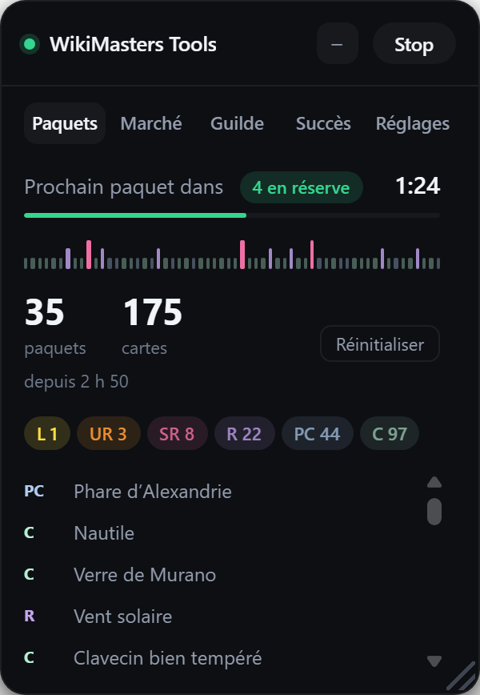

# WikiMasters Tools

Un panneau qui se greffe dans [wiki-masters.com](https://www.wiki-masters.com) et
travaille pendant que vous faites autre chose : il ouvre vos paquets dès qu'ils
se régénèrent, chiffre la valeur réelle de vos cartes, surveille les enchères et
remet en vente vos invendus.

C'est un **userscript** : un seul fichier, qui tourne dans votre navigateur avec
votre session. Aucun identifiant demandé, aucun compte à créer, rien envoyé
nulle part.

---

## Installation

**1. Installez l'extension Tampermonkey.**
Cherchez `tampermonkey` suivi du nom de votre navigateur — `tampermonkey chrome`,
`tampermonkey brave`, `tampermonkey firefox` — et installez-la depuis la boutique
officielle. Brave, Edge et Opera passent par le Chrome Web Store.

**2. Autorisez les scripts utilisateur.**
Sur Chrome : `chrome://extensions` → carte Tampermonkey → **Autoriser les scripts
utilisateur**.

> ⚠️ C'est l'étape que tout le monde rate. Sans elle, le script s'installe
> normalement mais ne s'exécute **jamais**, et rien ne vous le dit.

**3. Ouvrez le lien d'installation.**

**→ [Installer WikiMasters Tools](https://raw.githubusercontent.com/D1d1s/wikimasters-tools/main/wikimasters-auto.user.js)**

Tampermonkey affiche sa page d'installation, vous cliquez sur **Installer**. Rien
à télécharger ni à ranger : le lien *est* l'installation.

**4. Lancez-le.**
Retournez sur WikiMasters, **actualisez la page** (`F5`) → le panneau apparaît en
bas à droite → **Start**.

> Un onglet déjà ouvert avant l'installation ne charge pas le script.
> L'actualisation n'est pas optionnelle.

Les mises à jour se font ensuite toutes seules — Tampermonkey s'en charge, sur
son propre calendrier, en général dans les 24 h.

Le panneau n'attend pas jusque-là pour vous le dire : dès qu'une version plus
récente est publiée, une **pastille verte** paraît à côté du titre. Un clic
dessus la propose tout de suite, et vous actualisez la page.

---

## Le Discord

Aide, nouvelles versions, et le guide du panneau onglet par onglet :

### → [discord.gg/m5NHPSSk6B](https://discord.gg/m5NHPSSk6B)

C'est le seul endroit où poser une question. L'invitation n'expire pas, elle peut
être partagée librement.

---

## Ce que ça fait

**📦 Paquets** — ouvre vos paquets en boucle, au rythme que le serveur autorise,
et dort jusqu'à l'heure exacte de régénération plutôt que de le harceler. Compte
à rebours, journal des tirages, paliers de collection avec le temps qu'ils
demandent, et les succès dont la récompense **attend d'être réclamée**. Cliquer
une pastille de rareté ouvre votre collection sur ces seuls tirages.

**🪙 Marché** — vos enchères, vos ventes et leurs emplacements, les cartes de
votre liste de souhaits mises aux enchères — avec le prix demandé **comparé à
leur cote** — et la remise en vente automatique des invendus, **toujours au prix
que vous avez fixé**. Après deux échecs, le panneau en propose un plus bas ; il
attend votre clic.

**🏰 Guilde** — les cartes que vous pouvez donner tout de suite, avec le karma
que chacune rapporte, et un lot de cinq à publier dans le tchat. Et **quels de
vos souhaits sont déjà chez vos amis**, Légendaires en tête, avec la page
d'échange ouverte au bon nom en un clic.

**Et dans les pages du jeu** — un tri **par prix** de toute la collection, un
bouton **Tout souhaiter** qui met une recherche entière en liste de souhaits —
des centaines de cartes en un clic au lieu d'autant de gestes — et une page de
revente qui vous dit à quel prix vendre et sur quelles cartes vous seriez le
seul vendeur.

---

## Ce que ça ne fait pas

- Il ne demande **aucun identifiant** et n'envoie rien à personne.
- Il ne **contourne pas** la vérification humaine du site : il s'arrête, vous
  prévient, et repart seul quand vous avez coché.
- Il ne **vend ni ne donne** à votre place. Ces gestes sont irréversibles, ils
  restent à votre main — les relances automatiques sont d'ailleurs décochées par
  défaut.
- Il ne va pas plus vite que ce que le serveur autorise.

---

## Compte PRO ou gratuit

Tout fonctionne dans les deux cas. Ce qui change vient du site, pas de l'outil :
la régénération d'un paquet (~3 min avec PRO, ~10 min sans) et le pack quotidien
bonus, réservé aux comptes PRO.

Si les prix affichent « réservé aux comptes PRO », vérifiez que **Accès direct
à la base** est coché dans les Réglages. Il l'est par défaut.
